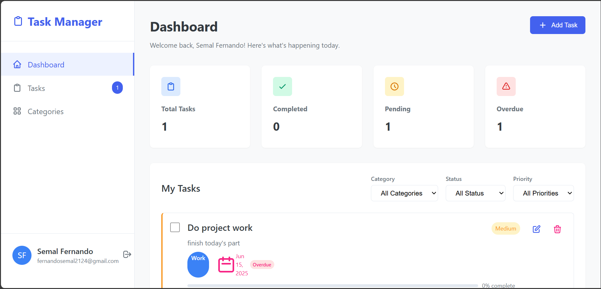

# Task Management Application



## 📘 Project Description
A full-stack task management system built using Laravel and Vue.js, offering:

- User authentication (registration/login)
- Task CRUD operations
- Task organization by:
  - **Category**: Work, Personal, Urgent
  - **Status**: Pending, In Progress, Completed
  - **Priority**: High, Medium, Low
- Responsive Vue.js dashboard with dynamic filtering

## 🛠 Technologies Used

| Area             | Technology       |
|------------------|------------------|
| Backend          | Laravel 10       |
| Frontend         | Vue 3 + Vuex     |
| Database         | MySQL            |
| Authentication   | Laravel Sanctum  |
| State Management | Vuex             |
| Styling          | Custom CSS       |

## 💻 Requirements

Before running the project, make sure you have:

- PHP 8.1+
- Node.js 18+
- MySQL 8+
- Composer
- NPM

## 📁 Folder Structure

```bash
project-root/
├── backend/        # Laravel API backend
├── frontend/       # Vue.js frontend
└── README.md
```

## Setup Instructions
```bash
# Backend
cd backend
composer install
cp .env.example .env
php artisan key:generate
php artisan migrate --seed
php artisan serve

# Frontend
cd frontend
npm install
npm run dev
```

## Assumptions
- Each user can only manage their own tasks.
- Tasks belong to categories (one-to-many relationship).

## Development Decisions  
1. **Task Organization**  
   - Used dropdown selects for category/status/priority  
   - Implemented frontend filtering (no backend categorization)  

2. **Authentication**  
   - Chose Laravel Sanctum for auth  

3. **Unimplemented Features**  
   - Backend task categorization (UI allows selection)


## Can- be-done
- Implement backend task categorization logic
- Add email notifications for task reminders
- Add pagination and search to task list